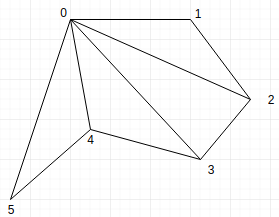

### How to run?

Open the folder Assignment1 *(where makefile is present)* in terminal
and run the command "**make**"" to compile the project. To open the
project open the executable using the command "**./modelling**". Details
about how to create and view model are given in respective modes

Modes
-----

There are two modes as per requirement- Modelling Mode and Inspection
Mode . By pressing '**M**', we can activate the modelling mode where
object can be modelled using various points and colors. In Inspection
Mode which is activated by pressing '**I**', translation and rotation
are implemented as per requirement for viewing the model. Details are
given in further sections.

Default mode is the inspection mode

### Modelling Mode

The xy plane is the visible plane with default z coordinate set to 0 and
color set to "0.5, 0.5, 0.5" . \
We can change the z coordinate, color by pressing keys as follows:

**Controls:**

-   "**PgUp**"- decreases the z coordinate by 0.1
-   "**PgDn**"- increases the z coordinate by 0.1
-   "**1**" - decreases the value of RED by 0.1
-   "**2**" - increases the value of RED by 0.1
-   "**3**" - decreases the value of GREEN by 0.1
-   "**4**" - increases the value of GREEN by 0.1
-   "**5**" - decreases the value of BLUE by 0.1
-   "**6**" - increases the value of BLUE by 0.1
-   "**Left\_Mouse\_Click**" - adds a point
-   "**SHIFT**+ **Left\_Mouse\_Click**" - removes the last added point
-   "**H**" - Disconnect the polygon *(Draws the polygon using the
    clicked points till now and starts new polygon drawing. Nothing of
    current polygon will be displayed until H is pressed to end it)*

**Working:**

To draw any model, break the model into polygons which may even be 3D
polygons and draw polygons one by one

Select the points one by one to draw a polygon and then press "H" to
finish a polygon and start a new one

While selecting the points you can move around the z-axis *(although
this won't be visible in modelling mode)* and change the colors of the
vertices using the controls mentioned above

Anytime during drawing, you can change the mode to see how the model
will look from different angles

The algorithm for sub-dividing the polygon into triangles is such that
each of triangles will have 0th point as one vertex and base will be
consecutive points. It is explained in the diagram below:

### Inspection Mode

The inspection mode allows translation, rotation and shifting of
centroid as follows:

**Controls:**

-   "**LEFT**"- rotation along y axis by -1
-   "**RIGHT**"- rotation along y axis by +1
-   "**UP**"- rotation along x axis by -1
-   "**DOWN**"- rotation along x axis by +1
-   "**PgUp**"- rotation along z axis by -1
-   "**PgDn**"- rotation along z axis by +1
-   "**W**"- translate along positive y axis by 0.1
-   "**S**"- translate along negative y axis by 0.1
-   "**A**"- translate along negative x axis by 0.1
-   "**D**"- translate along positive x axis by 0.1
-   "**Z**"- translate along negative z axis by 0.1
-   "**X**"- translate along positive z axis by 0.1
-   "**K**" - saves the model *(You need to enter the filename without
    extension. You need to change cursor focus to terminal before
    entering the filename)*
-   "**L**" - loads a previously saved model *(Enter filename with
    extension in the terminal. You need to change cursor focus to
    terminal before entering the filename)*

**Working:**

Use the above keys to rotate*(around its own centroid)* or translate the
object as you wish.

Current window needs to be terminal while entering filenames, and the
OpenGL window when using above controls

Output:
-------

Here are some screenshots of the final models created using this project

### Simple hut:

File: myhut.raw

### Windmill:

File: windmill.raw

### Japanese fan:

File: fan.raw

 

References
----------

-   [Tutorial 4: Prespective and Orthographic
    Viewing](https://www.cse.iitb.ac.in/~paragc/teaching/2017/cs475/tutorials/04_camera_viewing.tgz)
-   [OpenGL get cursor coordinate on mouse click in C++ - Stack
    Overflow](https://stackoverflow.com/a/45130457/5178671)
-   [c++ - Passing a string to file.open(); - Stack
    Overflow](https://stackoverflow.com/a/10966454/5178671)
-   [Input/output with files - C++
    Tutorials](http://www.cplusplus.com/doc/tutorial/files/)
-   [GLFW: Input
    reference](http://www.glfw.org/docs/latest/group__input.html)

